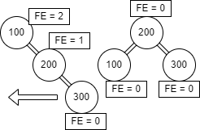
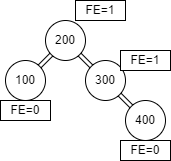

<div align="center">
<table>
    <theader>
        <tr>
            <td></td>
            <th>
                <span style="font-weight:bold;">UNIVERSIDAD NACIONAL DE SAN AGUSTIN</span><br />
                <span style="font-weight:bold;">FACULTAD DE INGENIERÍA DE PRODUCCIÓN Y SERVICIOS</span><br />
                <span style="font-weight:bold;">DEPARTAMENTO ACADÉMICO DE INGENIERÍA DE SISTEMAS E INFORMÁTICA</span><br />
                <span style="font-weight:bold;">ESCUELA PROFESIONAL DE INGENIERÍA DE SISTEMAS</span>
            </th>
            <td></td>
        </tr>
    </theader>
    <tbody>
        <tr><td colspan="3"><span style="font-weight:bold;">Formato</span>: Informe de Práctica de Laboratorio</td></tr>
        <tr><td><span style="font-weight:bold;">Aprobación</span>:  2022/03/01</td><td><span style="font-weight:bold;">Código</span>: GUIA-PRLD-001</td><td><span style="font-weight:bold;">Página</span>: 1</td></tr>
    </tbody>
</table>
</div>

<div align="center">
<span style="font-weight:bold;">INFORME  DE LABORATORIO</span><br />
</div>

<table>
<theader>
<tr><th colspan="6">INFORMACIÓN BÁSICA</th></tr>
</theader>
<tbody>
<tr><td>ASIGNATURA:</td><td colspan="5">Estructura de Datos y Algoritmos</td></tr>
<tr><td>TÍTULO DE LA PRÁCTICA:</td><td colspan="5">Árboles</td></tr>
<tr>
<td>NÚMERO DE PRÁCTICA:</td><td>05</td><td>AÑO LECTIVO:</td><td>2022 A</td><td>NRO. SEMESTRE:</td><td>III</td>
</tr>
<tr>
<td>FECHA INICIO::</td><td>20-Jun-2022</td><td>FECHA FIN:</td><td>24-Jun-2022</td><td>DURACIÓN:</td><td>02 horas</td>
</tr>
<tr><td colspan="6">RECURSOS:
    <ul>
        <li>https://www.w3schools.com/java/</li>
        <li>https://www.eclipse.org/downloads/packages/release/2022-03/r/eclipse-ide-enterprise-java-and-web-developers</li>
        <li>https://algorithmtutor.com/Data-Structures/Tree/AVL-Trees/</li>
        <li>https://docs.oracle.com/javase/tutorial/java/generics/types.html</li>
</td>
</<tr>
<tr><td colspan="6">Alumnos:
<ul>
<li>Vladimir Arturo Sulla Quispe - vsullaq@unsa.edu.pe</li>
</ul>
</td>
</<tr>
<tr><td colspan="6">DOCENTES:
<ul>
<li>Richart Smith Escobedo Quispe - rescobedoq@unsa.edu.pe</li>
</ul>
</td>
</<tr>
</tdbody>
</table>

# SOLUCION Y RESULTADOS
## I. SOLUCION DE EJERCICIOS/PROBLEMAS
### ORGANIZACION

```

├───Main.java
├───README.md
│
├───datastructures
│   ├───AVLTree.java
│   ├───AVLTreeInterface.java
│   └───Node.java
│       
├───exercises
│   └───Exercises.java
│       
└───imagenes
    
``` 
Donde:

- Main.java donde se hacen los test del ejercicio 1 y 3
- excecises donde se almacena la clase que contiene el ejercicio 1
- datastructure contiene los archivos correspondientes a la implementacion del arbol AVL
- imagenes donde se almacenan las imagenes que contiene README.md
    
### RESOLUCION
#### EJERCICIO 1

El primer ejercicio consiste en comprobar el balanceo de corchetes. Los corchetes se consideran balanceados si:
    - No tiene parentesis que no coincidan.
    - El subconjunto de corchetes encerrado dentro de los límites de un par de corchetes emparejados también es un par de corchetes emparejados.
Para ello tendremos el siguiente metodo:
    
```java
    // Los corchetes de inicio como de cierre estan a un mismo nivel 
    String begin = "([{";
    String end = ")]}";
    boolean balance;
    int i = 0;
    
    while(i < a.length()/2) {
        //Comprueba si el corchete del inicio(begin) corresponde al corchete de fin(end) 
        balance = begin.indexOf(a.charAt(i)) != end.indexOf(a.charAt(a.length()- 1 - i));
        if (balance) {
        //Retorna no terminando con el bucle y el metodo
            return "NO";
        }
            i++;
    }
    // Si no hubo problemas retorna si
    return "YES";
```
    
#### EJERCICIO 2
    
Simular las siguientes operaciones de un árbol AVL
-Inserción: 100 - 200 - 300 - 400 - 500 - 50 - 25 - 350 - 375 - 360 - 355 - 150 - 175 - 120 - 190.
-Para este ejercicio tienes que escribir el paso a paso del desarrollo de cada operación donde se muestra gráficamente el estado del árbol así como el factor de equilibrio para cada nodo y el tipo de operación que se está realizando, es decir, inserción, eliminación, rotación.

- Primero se inserta el primer nodo<br>


-200<br>


- 300 rotacion simple izquierda en 200<br>


- 400<br>

                           
- 500 rotacion simple izquierda en 400<br>


- 50<br>
                    
                           
- 25 se requiere una rotacion simple derecha en 50<br>

                           
- 350 <br>


- 375 requiere una rotacion simple izquierda en 350<br>

                   
- 360 requiere una rotacion derecha y luego una izquierda en 375<br>


- 355 requiere una rotacion derecha e izquierda en 350 <br>


- 150 requiere rotacion derecha izquierda en 100<br>

                           
- 175<br>

                           
- 120<br>

                    
-190 require rotar a la izquierda y luego derecha en 175<br>


-Después de crear un árbol AVL, realice la eliminación: 100 - 200 - 300 - 400 - 500 - 50 - 25 - 350 - 375 - 360 - 355 - 150 - 175 - 120 - 190.

- Elimiacion de 100 implica una rotacion izquierda


- Eliminar 200 no da rotaciones<br>


- Si se elimina 300 debe de hacerse una rotacion izquierda derecha en 150<br>


- 400<br>

  
- 500 se debe hacer rotacion en 360 <br>


- 50<br>


- 25<br>

  
- 350<br>


- 375<br>


- 360<br>


- 355 una rotacion simple en 150 <br>


- 150 rotacion simple en 190<br>


- 175<br>


- 120<br>


-190<br>
    
#### EJERCICIO 3
Implementar un arbol AVL conlas interfacecs dadas. El arbol AVL se ubica en /.datastructures
Para la realizacion del arbol AVL se considero la interfaz con los metodos
    - insert   
    - remove
    - get
    - contains
    - size
    - preorder
    - postorder
    - inorder
    - clear
    - height
    - getRoot
La mayoria de estos metodos requiren un conocimiento en recursividad.
    
## II. CONCLUSIONES

    
# RETROALIMENTACION GENERAL
    
    
# REFERENCIAS Y BIBLIOGRAFIA

```
https://www.cs.usfca.edu/~galles/visualization/AVLtree.html
```
